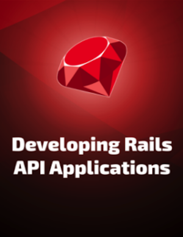

[](https://gitpitch.com/enogrob/ebook-project/master)
```
Roberto Nogueira  
BSd EE, MSd CE
Solution Integrator Experienced - Certified by Ericsson
```
# eBook Developing Rails API Applications



**About**

Learn everything you need to about the subject of this `eBook` project.

[Homepage](https://ebook.com)

## Topics
```
[ ] Welcome to Developing Rails API Applications
[ ] Rails APIs: The First 10 Minutes
[ ] Coding Your First RESTful Resource
[ ] Serializing Model Data
[ ] Testing Your API
[ ] Basic Authentication
[ ] OAuth Authentication
[ ] Getting a Head Start with JSON:API
[ ] Where Do We Go From Here?
```
